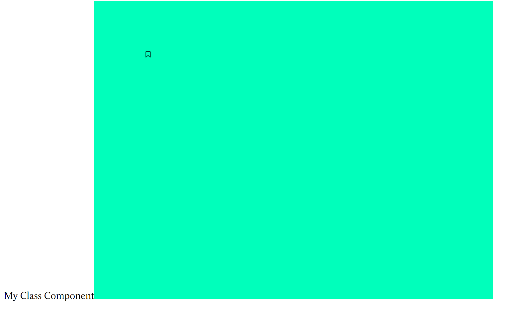

# 配置pixijs


为了配合React，进行程序开发，我们需要安装pixijs和pixiReact
```
npm i pixi.js @inlet/pixi-react
```
然后在src文件夹中创建一个新的Canvas文件夹，文件夹下创建一个assets文件夹用来保存图片等资源。

随手从icons8上搜一张图片放进去：bookmark-16.png


然后在index.js中写下：
```js
//src/Canvas/index.js
import React from 'react';
import { Stage, Sprite } from '@inlet/react-pixi';
import bookmarkImg from './assets/bookmark-16.png';

class Canvas extends React.Component {
  render() {
    return (
      <Stage width={800} height={600} options={{backgroundColor: 0x00FFbb}}>
        <Sprite image={ bookmarkImg } x={100} y={100}></Sprite>
      </Stage>
    )
  }
}

export default Canvas;

```
并在App中引入

```js
//src/App.js
import React from 'react';
import Canvas from './Canvas';

class App extends React.Component {
  render() {
    return (
      <div>
        My Class Component
        <Canvas />
      </div>
    )
  }
}

export default App;

```

之后npm run dev，能看到如下的结果，表示成功：
