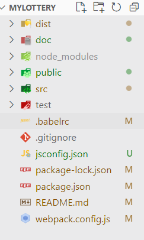

# 基于react, mobx和pixiJS的抽奖系统

麻雀虽小队 朱子航

## 开发需求

本项目是在学习结束字节跳动青训营课程之后完成的实践项目，需求是不限定工具写一个抽奖界面。

### 开发需求具体化

具体来说，开发要求完成
- 交互界面：实现程序的状态转移
- 核心算法：实现抽奖的核心算法
- 可视化过程：实现对每个过程的动画可视化

### 产品逻辑
- 开始界面
- 用户点击“获取抽奖名单”，初始化抽奖者名单，同时UI表现抽奖者进入的过程，维持抽奖者名单就绪的状态，等待用户下一步。
- 用户输入奖品数量，点击“确认”按钮提交表单，系统获得奖品数量，并验证其小于抽奖者名单。UI表现准备奖品的过程，并维持奖品就绪的状态。
- 用户点击“开始抽奖”，系统根据抽奖者名单和奖品数量计算出获奖名单。UI显示正在抽奖的过程，维持抽奖已经结束的状态。
- UI在一个明显的转场之后，公布获奖者名单。

## 团队分工

因为身边没有可以线下沟通的同学，考虑到线上沟通开发的效率可能会更低，所以我决定一个人完成该项目的开发。

### 开发进度

- 8月30日确定需求，创建项目，开始进行开发
- 8月31日设计思路，技术选型
- 9月1日进行环境配置和关键功能设计
- 9月2日新建代码仓库，环境配置，边写文档边查看资料边进行开发
- 9月3日完成核心功能代码，解决了几个bug，书写报告

主要的开发过程集中在9月2日和3日之间。


## 结果展现

我录了一个视频来展现结果，具体见附件[[reuslt.mp4]]

整体上是一个这样的界面：


可以看到下方有init, debug，get Candidates按钮，分别对应“开始”，“调试”（开发过程中使用），“获得参与者名单”

在点击init之后，会呈现这样的状态，是一张用PIXI.js绘制出来的3D星空图，我们的视角在不断向前进（具体可见视频）。


点击get Candidates按钮之后， 后台就会准备好参与者名单（在这里简便起见，我使用了一个0-50的整数数组来代替），这时候动画视角开始缓慢后退，表示和刚刚的状态区别。

而后在输入框中输入奖品数量，如果奖品数量大于参与者人数会失败回退，如果合法，则可以点击开始抽奖（Start Lottery）

点击开始抽奖之后，所有星星会快速往中间聚集，稍后中央呈现出爆炸效果，表示正在进行抽奖。


动画之后，屏幕上显示一行字体：“抽奖已经结束，点击下方按钮查看获奖名单”。最开始的时候其实想要做一个获奖者名单弹出的效果的，后来考虑开发进度删去了。


点击右侧的Show Result按钮，就可以在屏幕下方获得获奖者名单，如图所示：


## 框架讲解

因为有意想要让自己接触比较底层的原理，所以我没有使用现成的脚手架，而是自己用git, webpack, babel等进行开发环境的搭建：

具体来说就是安装babel和webpack，参考一些文件进行配置。最后的目录大概是这样：



具体参考源码。实现了把src中的文件编译成dist中的main.js并把public文件夹中的资源静态托管。使用webpack-dev-server进行开发调试。期间遇到过一些问题，可以参考9月3日debug的记录[[doc/dev/2021-09-03debug]]

### 安装依赖
```
npm install

```
### 功能调试

```
npm run dev
```
并在localhost:8080进行调试

### 打包发布

```
npm run prod
```

## 源码讲解
在src目录中，index.js为入口，实现了一个Manager类，用来管理整个项目流程。其中的render函数封装了ReactDOM.render，用来进行渲染。因为项目的整体结构较为简单（同时因为分拆好像有不知道怎么回事的bug），所以就没有进行组件分拆，直接在Manager中完成了函数和界面的实现。

而scripts中是核心逻辑代码，分辨在candidates中实现了generateCandidatas函数来获取参与者，在core.js中封装了函数的核心算法。这样的拆分保证了各个部分的解耦和可扩展，让代码在未来面对更加复杂的输入、输出途径，更多方式的核心算法功能的时候可以在对应的文件中生长出独立的代码而不影响其他部分。

在PixiApp中，assets为资源文件。分别是星空资源，还有最后的爆炸图资源。在index.js中完成了PIXIApp类，并创建了一个pixiApp实例并输出，这个类封装了对于动画界面的管理和实现。星空中的核心元素Star专门封装到objects/star.js文件中，定义了其

- 在指定规则下随机生成的randomize方法
- 类似万有引力规律向中心聚集的center方法
- 从三维对象映射到二维屏幕的proj方法

然后在PixiApp中主要利用app.stage和app.ticker实现了其不同的阶段动画表达：
- StageA: 已经完成初始化之后的等待动画
- StageB: 已经获得参与者之后的等待动画
- StageC: 用户点击“开始抽奖”之后星空聚集动画
- StageD: 表示抽奖的爆炸动画
- showStage: 表示结束展示结果的动画
- finish: 结束
- reset：重启

使用mobx的makeAutoObservable来让整个Manager类的更新变得可以追踪，并用autorun来调用Pixi中的changeStage管理方法，让用户可以通过React组件界面来间接操控canvas上的显示过程。

### 难点1：抽奖核心算法

该项目的核心功能为如何从n个项目中随机选取m个，并确保选取的结果是公平的。在具体开发算法之前，我们首先规定核心功能的输入来源和测试计划。

#### 数据来源
使用如下函数生成一列数组来代表不同的抽奖者
```js
export function generateCandidates(n) {
  let candidateList = [];
  for (let i = 0; i < n; i++) {
    candidateList.push(i);
  }
  return candidateList;
}

```

#### 测试要求

对该项功能的单元测试要求能够根据生成的数组生成指定数量的幸运儿，而且要确保每个参与者中奖的机会是公平的。因此我们分两步骤进行单元测试，第一步确认能够生成制定数量的合法编号，第二步证明其公平。

#### 实现功能

```js
test1(getLuckies, n, m){
  alert(generateCandidates(n),m).length == m)
}

```

#### 确认公平

想要确认其公平，也就是在重复相当多次抽奖之后，可以让各个成员中奖的次数大致相等（方差很小，简化方法就是最大值与最小值的差比平均值是一个小量）
```js

```

#### 算法实现

回忆课上月影老师讲过的洗牌算法，发现可以直接将成员进行洗牌之后选取前m个，这样就可以在保证公平的基础上用一种相当简便的方法抽奖。

算法实现如下：

```js

function shuffle(list) {
  let c = [...list];
  for (let i = c.length; i > 0; i--) {
    const pIdx = Math.floor(Math.random() * i);
    [c[pIdx], c[i - 1]] = [c[i - 1], c[pIdx]];
  }
  return c;
}

export function getLuckies(candidateList, prizeNum) {
  //shuffle the candidate list and get the upper prizeNum candidates as Lucky men
  let shufRes = shuffle(candidateList);
  return shufRes.filter((item, id) => {
    return id < prizeNum;
  })
}
```

#### 数学证明

下面我们从数学上证明这个算法是公平的。

首先，在shuffle中，i随机取0~i-1之间的某个整数，每个被抽到的概率为1/i,并将其与当前最后一个交换位置。被交换过后的值在之后就不再移动。每个数落到最后的概率均为1/i。也就是在第一轮中，每个数被排到最后的概率为1/n，而下一轮中，对于剩下的n-1个数重复上述过程，所以每个数排到倒数第二的概率为(1-1/n)*(1/(n-1))容易证明等于1/n，数学归纳法可知，所有数字最后落在任何位置的可能性都是1/n，因此所有数字落到被选取集合中的概率为m/n，这是一个公平的算法。

### 难点2：3D星空实现
3D星空核心算法在于使用图形学的知识完成一个三维到二维的位置映射，并对不同位置的星星进行视角差放大:
```js
 proj(cameraZ, width, height, fov, speed) {
    //console.log(cameraZ, width, height, fov, speed);
    if (this.z < cameraZ || this.z > cameraZ+3000) this.randomize(cameraZ);
    const z = this.z - cameraZ;
    this.sprite.x = this.x * (fov / z) * width + width / 2;
    this.sprite.y = this.y * (fov / z) * height + height / 2;
    const dxCenter = this.sprite.x - width / 2;
    const dyCenter = this.sprite.y - height / 2;
    const distanceCenter = Math.sqrt(dxCenter * dxCenter + dyCenter * dyCenter);
    const distanceScale = Math.max(0, (2000 - z) / 2000);
    this.sprite.scale.x = distanceScale * this.baseSize;
    this.sprite.scale.y = distanceScale * this.baseSize + distanceScale * speed * this.stretch * distanceCenter / width;
    this.sprite.rotation = Math.atan2(dyCenter, dxCenter) + Math.PI / 2;
  }
```

### 难点3：仿引力作用运动规律收拢动画

考虑万有引力方程，将其写成微分方程的形式，对于每个分量都有：
$$\frac{dx}{dt} = \frac{dx}{dt}+ \frac{GM}{r^3}xdt$$
$$x = x - \frac{dx}{dt}*dt$$

据此就可以简单地写出代码：

```js
center(delta, cameraZ) {
    const zdif = this.z - ( cameraZ + 1000 );
    const r = Math.sqrt(this.x * this.x + this.y * this.y + zdif * zdif);
    this.r = r;
    if (r > 15) {
      const k = 1000;
      this.dx = this.dx - this.x * k / (r * r * r) * delta;
      this.dy = this.dy - this.y * k / (r * r * r) * delta;
      this.dz = this.dz - zdif * k / (r * r * r) * delta;
      this.x = this.x + this.dx * delta;
      this.y = this.y + this.dy * delta;
      this.z = this.z + this.dz * delta;
    }//当前这个凑出来的效果似乎还行，暂时就别改了
  }

```
为啥要r>15呢？因为如果太小的话容易出现除零错误，然后又弹出去，我们只需要从远处聚集的那一段动画过程，如果已经临近中心，不妨就直接让其停下。

## 总结与感想

前端是一个可以很简单也可以很复杂的门类。使用相应的库和脚手架，初学者也可以在半天之内拿出一个可用可靠的项目，但是这样也把自己的能力限制在了框架推荐的范围内。作为工程师，更重要的可能还是什么样的问题都能找到办法解决，而不是单纯熟练使用更多更炫酷的框架。

这一次我的时间安排不是很好，之前因为其他事情耽误，9月3日截止的工程，直到8月30日左右才开始构思，到9月2日才开始正式写代码。可以说非常赶人了。更何况用到的这些框架其实我也都是初学（之前只是用脚手架写过一些react demo级别的东西），还作死想要了解很多底层实现的原理以及图形学的动画。

这些开发过程固然让我受益匪浅，但是也同时让我在这两天欲仙欲死。

这一次的底层试探经历让我对于很多原理性的东西有了更深的理解，也觉得很多炫酷的实现其实并不遥远。后面或许需要沉淀一段时间，系统研究自己目标方向的经典库的源码，刷题准备投简历。

感谢字节跳动这样的培训课程和经历，希望以后还有机会和各位可爱的讲师们相遇。

